<div align="center">

[](https://git.io/typing-svg)

<br>


[]()
[]()

</div>

<br>

<div align="center">



</div>

<br>

<div align="center">

```
╔══════════════════════════════════════════════════════╗
║   ❤  ✦  ❤  ✦  ❤  ✦  ❤  ✦  ❤  ✦  ❤  ✦  ❤  ✦  ❤   ║
╚══════════════════════════════════════════════════════╝
```

</div>

<br>

## ` ✿ S T A C K `

<div align="center">


</div>

<br>

## ` ✶ Q U O T E `

<div align="center">


</div>

<br>

<div align="center">

```
✦ ───────────────────── ❤ ───────────────────── ✦
```

</div>


